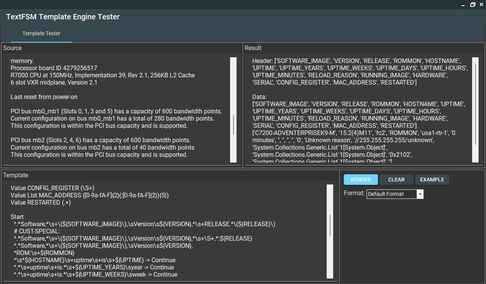
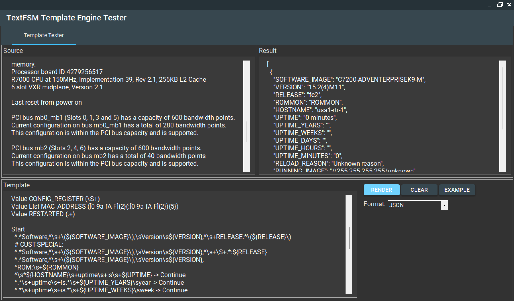
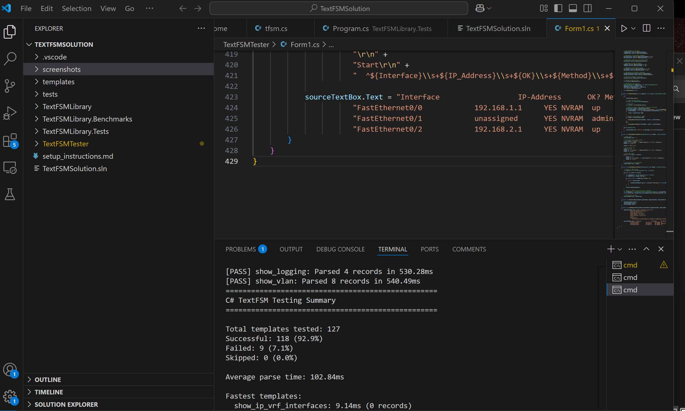

# TextFSMLibrary

A .NET implementation of TextFSM, a template-based text parsing engine that converts semi-structured text into structured data.

[](https://www.nuget.org/packages/TextFSMLibrary/)
[](https://github.com/username/TextFSMLibrary/actions)
[](LICENSE)

## Overview

TextFSMLibrary provides a robust way to parse text output from CLI devices, log files, and other semi-structured text sources. Based on the original Python TextFSM module used for network device parsing, this .NET implementation brings the same powerful pattern matching capabilities to the .NET ecosystem.

Key features include:

- Cross-platform support (.NET 8.0 and .NET Framework 4.7.2)
- PowerShell integration
- Regular expression pattern matching
- State-machine based parsing
- Simple template format
- JSON output support

## Installation

### Via NuGet

```
Install-Package TextFSMLibrary
```

### Manual Installation

Clone this repository and build the solution:

```
git clone https://github.com/scottpeterman/textfsm.net
cd TextFSMLibrary
dotnet build
```

## Quick Start

```csharp
using TextFSM;

// Define a TextFSM template
string template = @"
Value HOSTNAME (\S+)
Value OS_NAME (.+)
Value OS_VERSION (.+)

Start
  ^Host Name:\s+${HOSTNAME}
  ^OS Name:\s+${OS_NAME}
  ^OS Version:\s+${OS_VERSION}
";

// Input text to parse
string inputText = @"
Host Name:                 SERVER1
OS Name:                   Microsoft Windows Server 2019
OS Version:                10.0.17763 N/A Build 17763
";

// Create TextFSM instance and parse
var fsm = new TextFSM(template);
var results = fsm.ParseTextToDicts(inputText);

// Process results
foreach (var record in results)
{
    Console.WriteLine($"Hostname: {record["HOSTNAME"]}");
    Console.WriteLine($"OS: {record["OS_NAME"]}");
    Console.WriteLine($"Version: {record["OS_VERSION"]}");
}
```

## GUI Test Tool

The solution includes a Windows Forms application for testing TextFSM templates:



Paste your text, define your template, and view the structured output in real-time!



## PowerShell Integration

TextFSMLibrary includes PowerShell integration through the `PowerShellHelper` class. See [README_POWERSHELL.md](TextFSMLibrary/README_POWERSHELL.md) for detailed PowerShell usage instructions.

Basic example:

```powershell
# Load TextFSMLibrary
Add-Type -Path "path\to\TextFSMLibrary.dll"

# Define template and input text
$template = @'
Value HOSTNAME (\S+)
Value OS_NAME (.+)

Start
  ^Host Name:\s+${HOSTNAME}
  ^OS Name:\s+${OS_NAME}
'@

$inputText = Get-Content -Path "systeminfo.txt" -Raw

# Parse to JSON and convert to PowerShell objects
$jsonString = [TextFSM.PowerShellHelper]::ParseTextToJson($template, $inputText, $true)
$results = $jsonString | ConvertFrom-Json

# Display results
$results | Format-Table
```

## Template Syntax

### Value Definitions

```
Value [Options] NAME (REGEX)
```

- `Options`: Optional modifiers (Required, Filldown, Fillup, Key, List)
- `NAME`: Field name (alphanumeric)
- `REGEX`: Regular expression pattern enclosed in parentheses

### State Definitions

```
StateName
  ^REGEX -> ACTION NewState
```

- `StateName`: Name of the state (Start is required)
- `REGEX`: Regular expression to match text lines
- `ACTION`: Optional action (Continue, Next, Error, Clear, Clearall, Record, NoRecord)
- `NewState`: Optional state to transition to

### Value Options

- **Required**: Value must be present or record is skipped
- **Filldown**: Value persists between records until changed
- **Fillup**: Value fills upward after being set
- **Key**: Creates composite keys to avoid duplicates
- **List**: Collects multiple matches into a list

## Performance and Compatibility

### Benchmark Results

The library has been extensively tested with Cisco templates from NetworkToCode (NTC), with impressive compatibility and performance metrics:

```
C# TextFSM Testing Summary
==================================================
Total templates tested: 127
Successful: 118 (92.9%)
Failed: 9 (7.1%)
Skipped: 0 (0.0%)
Average parse time: 97.44ms
```

Special thanks to NetworkToCode (NTC) for their excellent template collection which made this compatibility testing possible.



## Project Structure

```
├── TextFSMLibrary            # Core library
│   ├── tfsm.cs               # Main TextFSM implementation
│   ├── PowerShellHelper.cs   # PowerShell integration
│   └── TextFSMLibrary.csproj # Project file
├── TextFSMLibrary.Tests      # Unit tests
├── TextFSMLibrary.Benchmarks # Performance benchmarks
├── TextFSMTester             # GUI testing application
├── powershell                # PowerShell examples
└── templates                 # Example templates
```

## Contributing

Contributions are welcome! Please feel free to submit a Pull Request.

1. Fork the repository
2. Create your feature branch (`git checkout -b feature/amazing-feature`)
3. Commit your changes (`git commit -m 'Add some amazing feature'`)
4. Push to the branch (`git push origin feature/amazing-feature`)
5. Open a Pull Request

## License

This project is licensed under the MIT License - see the [LICENSE](LICENSE) file for details.

## Acknowledgments

- Based on the original [TextFSM](https://github.com/google/textfsm) Python library by Google
- Inspired by network automation needs and structured data parsing challenges
- Thanks to NetworkToCode (NTC) for their comprehensive template collection used for compatibility testing